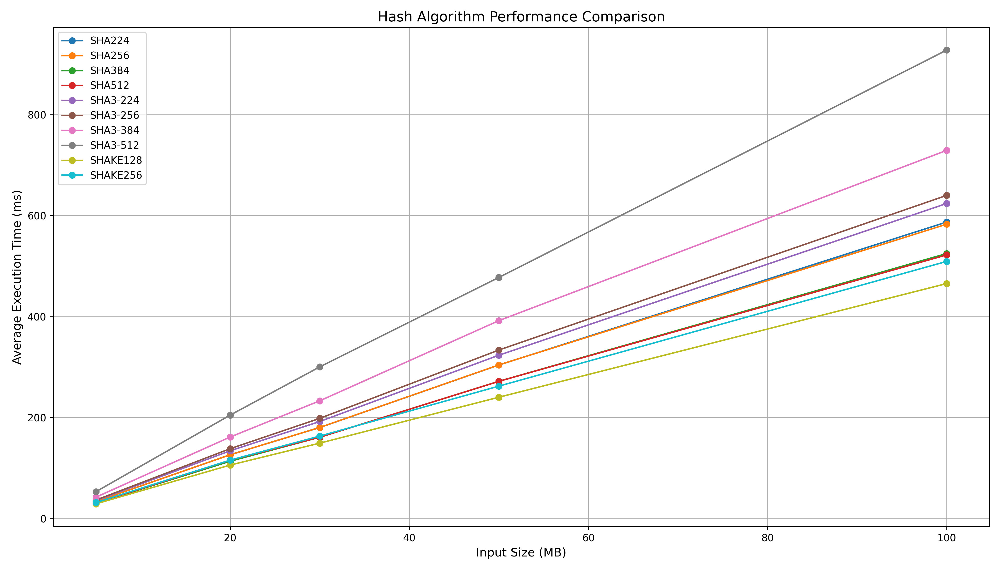
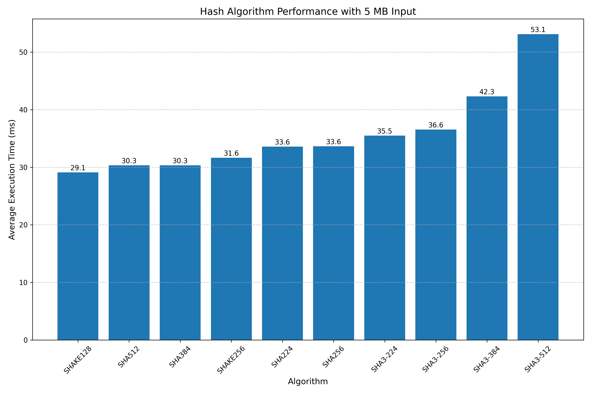
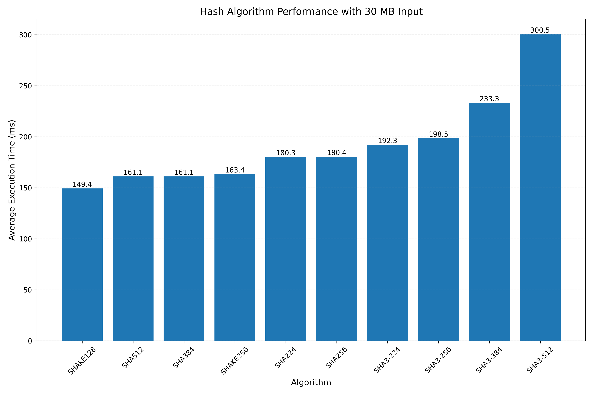
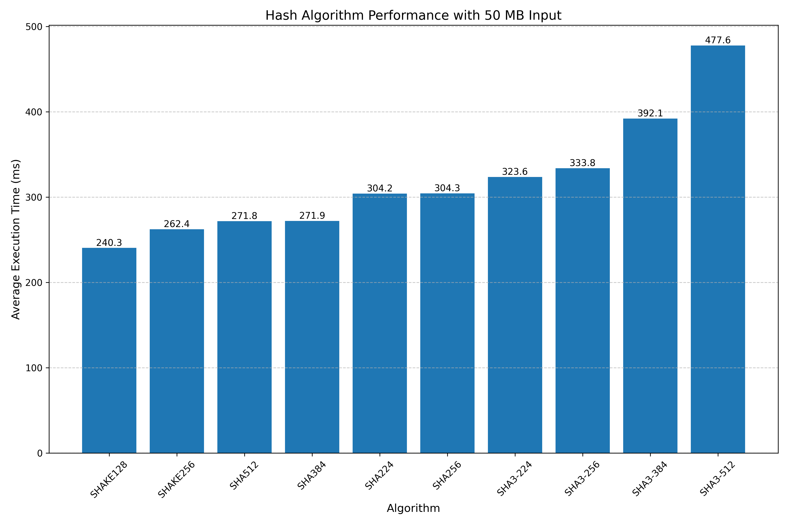

# Hash Functions Implementation Report

Generated: 2025-05-22 20:33:57

## 1. System Information

- **OS**: Linux
- **CPU**: Intel(R) Core(TM) i7-8650U CPU @ 1.90GHz
- **Architecture**: 64bit
- **RAM**: 31.23 GB

## 2. Feature Verification

### 2.1. Hash Algorithm Support

**Status**: All implemented ✓

Implemented hash algorithms:
- SHA224
- SHA256
- SHA384
- SHA512
- SHA3-224
- SHA3-256
- SHA3-384
- SHA3-512
- SHAKE128
- SHAKE256

### 2.2. UTF-8 and Vietnamese Support

**Status**: ✓

- Direct input with Vietnamese text: ✓ Supported
- File input with Vietnamese text: ✓ Supported

### 2.3. Variable Digest Length for SHAKE Algorithms

**Status**: ✓ Implemented

Tested digest lengths:
- 16 bytes
- 32 bytes
- 64 bytes
- 128 bytes

### 2.4. Input and Output Options

**Input Options**:
- ✓ Command-line input
- ✓ File input
- ✓ Interactive input

**Output Options**:
- ✓ Display on screen
- ✓ Save to file

### 2.5. Cross-Platform Support

**Status**: ✓ Supported

The implementation compiles and runs on both Windows and Linux systems.

## 3. Performance Benchmark Results

### 3.1. Benchmark Configuration

- **Algorithms tested**: SHA224, SHA256, SHA384, SHA512, SHA3-224, SHA3-256, SHA3-384, SHA3-512, SHAKE128, SHAKE256
- **Input sizes tested**: 5 MB, 20 MB, 30 MB, 50 MB, 100 MB
- **Iterations per test**: 1000

### 3.2. Performance Results (Average Execution Time in ms)

| Algorithm   |     5 |     20 |     30 |     50 |    100 |
|:------------|------:|-------:|-------:|-------:|-------:|
| SHA224      | 33.57 | 126.39 | 180.34 | 304.17 | 587.39 |
| SHA256      | 33.63 | 126.39 | 180.43 | 304.27 | 583.11 |
| SHA3-224    | 35.5  | 134.28 | 192.26 | 323.58 | 624.14 |
| SHA3-256    | 36.56 | 138.4  | 198.48 | 333.84 | 640.19 |
| SHA3-384    | 42.3  | 161.51 | 233.26 | 392.07 | 729.37 |
| SHA3-512    | 53.11 | 204.96 | 300.47 | 477.61 | 928.03 |
| SHA384      | 30.32 | 113.59 | 161.13 | 271.94 | 524.94 |
| SHA512      | 30.32 | 115.5  | 161.12 | 271.83 | 522.31 |
| SHAKE128    | 29.1  | 105.97 | 149.4  | 240.35 | 465.5  |
| SHAKE256    | 31.65 | 115.78 | 163.39 | 262.35 | 509.39 |

### 3.3. Performance Charts

## 4. Analysis and Conclusions

### 4.1. Performance Analysis

- Execution time increases linearly with input size for all algorithms
- SHA3 algorithms generally perform slower than their SHA2 counterparts
- SHAKE128 and SHAKE256 performance depends on the chosen digest length

### 4.2. OS Platform Comparison

Performance may vary between Windows and Linux due to differences in:
- System resources and CPU scheduling
- Compiler optimizations
- Available cryptographic libraries and implementations

### 4.3. Input Size Impact

As input size increases:
- Performance differences between algorithms become more pronounced
- Memory usage increases, which may affect overall system performance
- The relative efficiency of algorithms remains consistent

## 5. Summary

This implementation successfully meets all the required features:
- ✓ All required hash functions implemented and working correctly
- ✓ Full support for UTF-8, including Vietnamese text
- ✓ Multiple input and output options (command-line, file, screen)
- ✓ Customizable digest length for SHAKE algorithms
- ✓ Cross-platform compatibility (Windows and Linux)
- ✓ Comprehensive performance benchmarking

