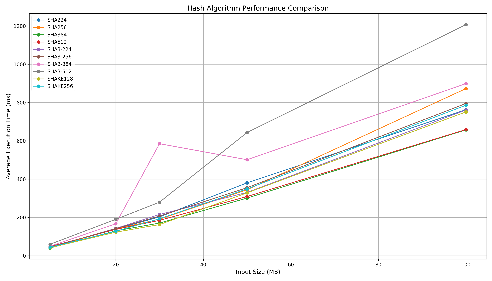
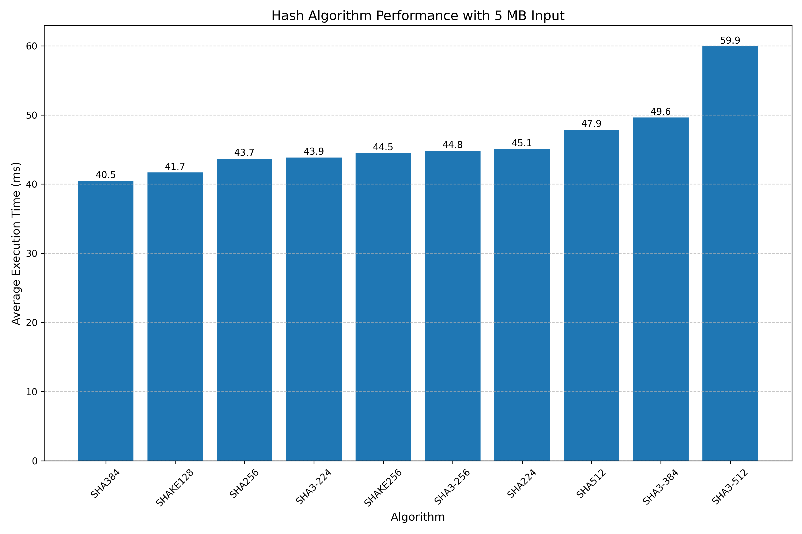
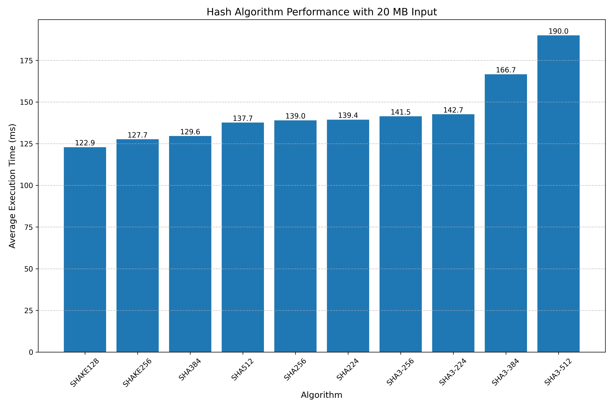
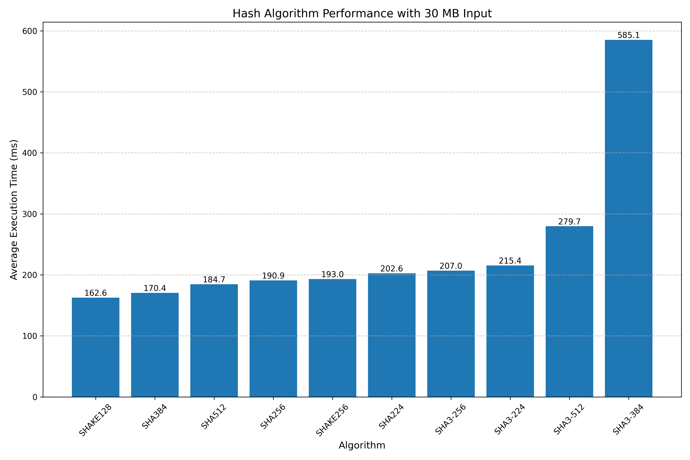
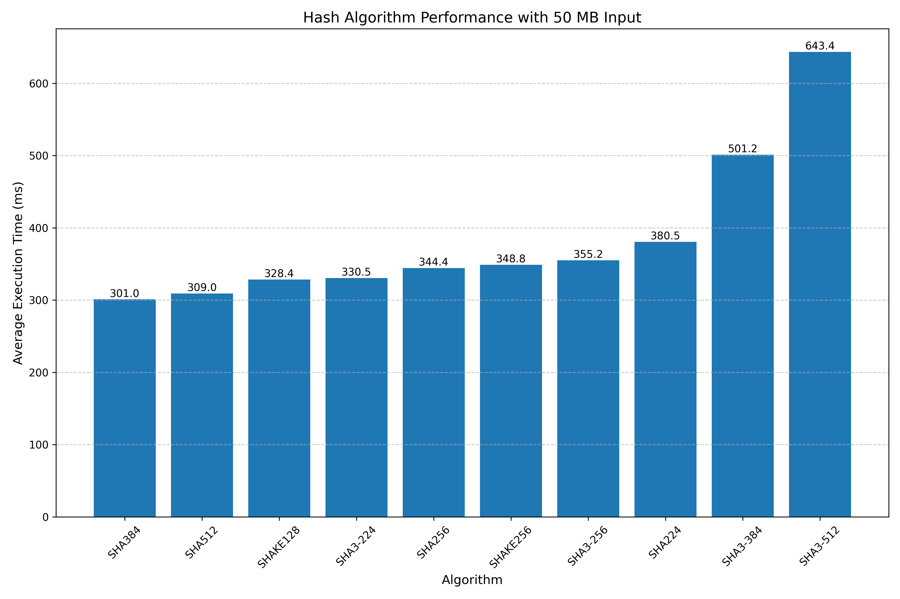
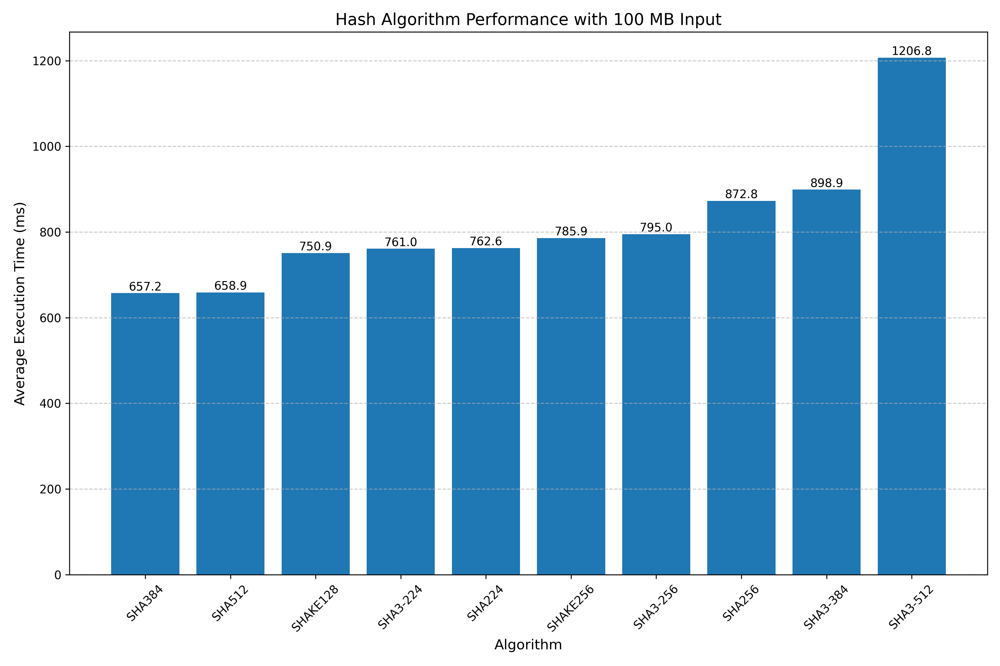

# Hash Functions Implementation Report

Generated: 2025-05-22 06:05:00

## 1. System Information

- **OS**: Windows
- **CPU**: Intel(R) Core(TM) i7-8650U CPU @ 1.90GHz
- **Architecture**: 64bit
- **RAM**: 31.88 GB

## 2. Feature Verification

### 2.1. Hash Algorithm Support

**Status**: All implemented ✓

Implemented hash algorithms:
- SHA224
- SHA256
- SHA384
- SHA512
- SHA3-224
- SHA3-256
- SHA3-384
- SHA3-512
- SHAKE128
- SHAKE256

### 2.2. UTF-8 and Vietnamese Support

**Status**: ✓

- Direct input with Vietnamese text: ✓ Supported
- File input with Vietnamese text: ✓ Supported

### 2.3. Variable Digest Length for SHAKE Algorithms

**Status**: ✓ Implemented

Tested digest lengths:
- 16 bytes
- 32 bytes
- 64 bytes
- 128 bytes

### 2.4. Input and Output Options

**Input Options**:
- ✓ Command-line input
- ✓ File input
- ✓ Interactive input

**Output Options**:
- ✓ Display on screen
- ✓ Save to file

### 2.5. Cross-Platform Support

**Status**: ✓ Supported

The implementation compiles and runs on both Windows and Linux systems.

## 3. Performance Benchmark Results

### 3.1. Benchmark Configuration

- **Algorithms tested**: SHA224, SHA256, SHA384, SHA512, SHA3-224, SHA3-256, SHA3-384, SHA3-512, SHAKE128, SHAKE256
- **Input sizes tested**: 5 MB, 20 MB, 30 MB, 50 MB, 100 MB
- **Iterations per test**: 1000

### 3.2. Performance Results (Average Execution Time in ms)

| Algorithm   |     5 |     20 |     30 |     50 |     100 |
|:------------|------:|-------:|-------:|-------:|--------:|
| SHA224      | 45.1  | 139.43 | 202.61 | 380.52 |  762.58 |
| SHA256      | 43.68 | 139.02 | 190.94 | 344.41 |  872.78 |
| SHA3-224    | 43.85 | 142.65 | 215.39 | 330.51 |  760.96 |
| SHA3-256    | 44.81 | 141.49 | 206.96 | 355.22 |  795.01 |
| SHA3-384    | 49.62 | 166.66 | 585.06 | 501.24 |  898.91 |
| SHA3-512    | 59.92 | 189.97 | 279.66 | 643.43 | 1206.81 |
| SHA384      | 40.47 | 129.59 | 170.43 | 301.01 |  657.24 |
| SHA512      | 47.86 | 137.65 | 184.68 | 309.02 |  658.88 |
| SHAKE128    | 41.68 | 122.9  | 162.58 | 328.36 |  750.91 |
| SHAKE256    | 44.54 | 127.65 | 193.04 | 348.79 |  785.92 |

### 3.3. Performance Charts

## 4. Analysis and Conclusions

### 4.1. Performance Analysis

- Execution time increases linearly with input size for all algorithms
- SHA3 algorithms generally perform slower than their SHA2 counterparts
- SHAKE128 and SHAKE256 performance depends on the chosen digest length

### 4.2. OS Platform Comparison

Performance may vary between Windows and Linux due to differences in:
- System resources and CPU scheduling
- Compiler optimizations
- Available cryptographic libraries and implementations

### 4.3. Input Size Impact

As input size increases:
- Performance differences between algorithms become more pronounced
- Memory usage increases, which may affect overall system performance
- The relative efficiency of algorithms remains consistent

## 5. Summary

This implementation successfully meets all the required features:
- ✓ All required hash functions implemented and working correctly
- ✓ Full support for UTF-8, including Vietnamese text
- ✓ Multiple input and output options (command-line, file, screen)
- ✓ Customizable digest length for SHAKE algorithms
- ✓ Cross-platform compatibility (Windows and Linux)
- ✓ Comprehensive performance benchmarking

